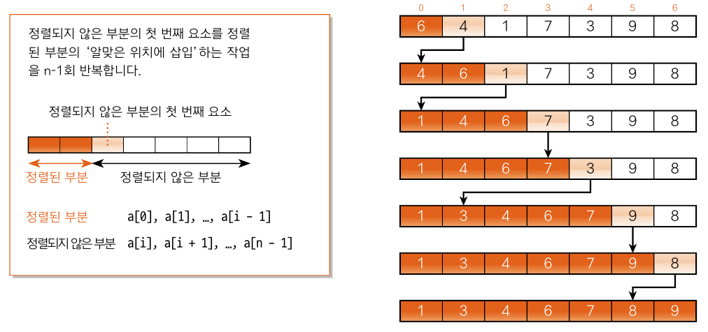
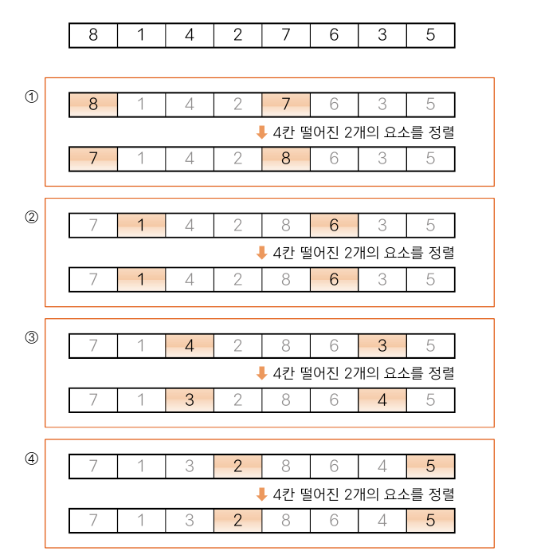
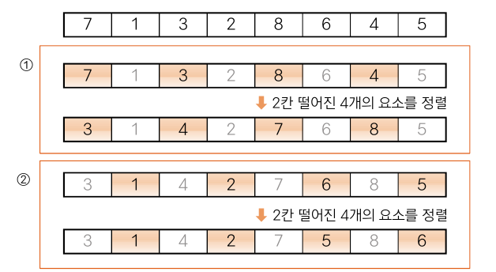
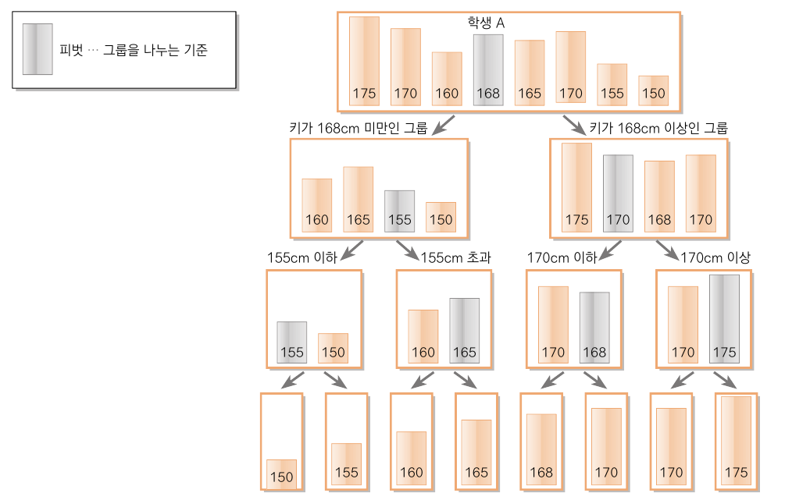
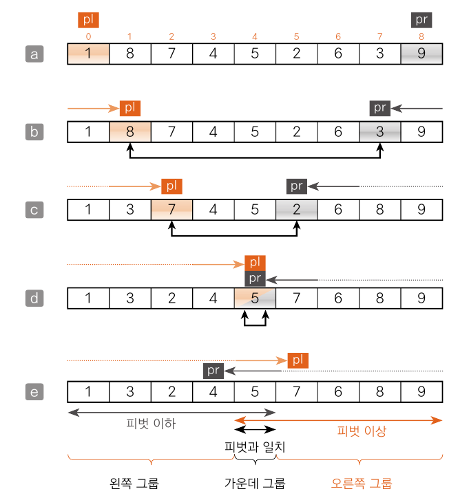
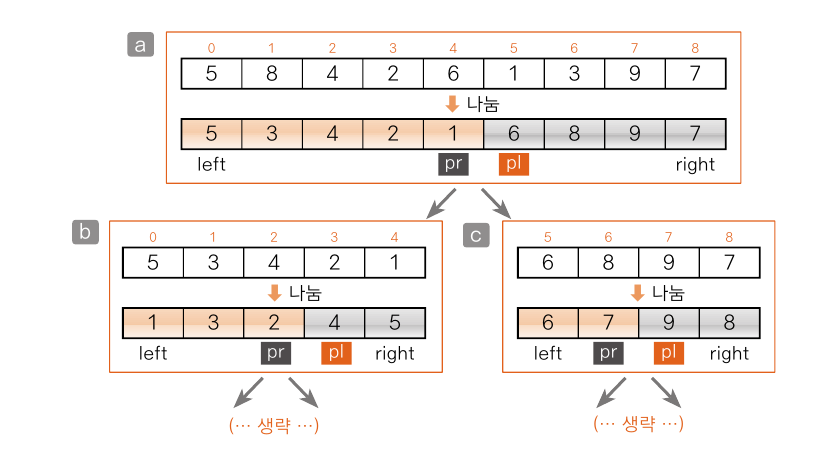

# 정렬 알고리즘

## 06-1 정렬 알고리즘이란?

### 정렬이란?

> 이름, 학번,키 등 key의 대소 관계에 따라 데이터 집합을 일정한 순서로 나열하는 작업
> 
> 오름 차순 : 값이 작은 데이터를 앞에 배치
> 
> 내림 차순 : 값이 큰 데이터를 앞에 배치

#### 정렬 알고리즘의 안정성

1. 안정된 정렬 
    - 키값이 같은 요소의 순서가 정렬 전후에도 유지됨
2. 안정되지 않은 정렬
    - 키값이 같은 요소의 순서의 정렬을 보장할 수 없음

#### 내부 정렬과 외부 정렬
1. 내부 정렬
   - 정렬할 모든 데이터를 하나의 배열에 저장할 수 있을 때에 사용
2. 외부 정렬
   - 정렬할 데이터가 너무 많아서 하나의 배열에 저장할 수 없을 때에 사용

#### 정렬 알고리즘의 핵심요소
- <span style="color:brown">교환</span>
- <span style="color:yellowgreen">선택</span>
- <span style="color:violet">삽입</span>
---

## 06-2 버블 정렬

> 이웃한 두 요소의 대소 관계를 비교하고 필요에 따라 교환을 반복하는 알고리즘

### 버블 정렬 알아보기

<table>
    <thead>
        <tr>
            <th style="background-color: white; color: black;">6</th>
            <th style="background-color: white; color: black;">4</th>
            <th style="background-color: white; color: black;">3</th>
            <th style="background-color: white; color: black;">7</th>
            <th style="background-color: white; color: black;">1</th>
            <th style="background-color: lightpink; color: black;">9</th>
            <th style="background-color: lightpink; color: black;">8</th>
        </tr>
    </thead>
</table>

먼저 끝에 있는 두 요소 9와 8부터 시작.
오름 차순으로 정렬을  위해서는 왼쪽 값이 오른 쪽 보다 작아야 한다.

따라서 9와 8을 교환한 배열은 다음 과 같다.

<table>
    <thead>
        <tr>
            <th style="background-color: white; color: black;">6</th>
            <th style="background-color: white; color: black;">4</th>
            <th style="background-color: white; color: black;">3</th>
            <th style="background-color: white; color: black;">7</th>
            <th style="background-color: lightpink; color: black;">1</th>
            <th style="background-color: lightpink; color: black;">8</th>
            <th style="background-color: white; color: black;">9</th>
        </tr>
    </thead>
</table>

그 이후 두 번째와 세 번째 요소인 1과 8을 비교한다. 1은 8보다 작으므로 교환할 필요가 없다.

이렇게 이웃한 요소를 비교하고 교환하는 작업을 첫 번째 요소까지 반복한 결과는

<table>
    <thead>
        <tr>
            <th style="background-color: lightgray; color: black;">1</th>
            <th style="background-color: white; color: black;">6</th>
            <th style="background-color: white; color: black;">4</th>
            <th style="background-color: white; color: black;">3</th>
            <th style="background-color: white; color: black;">7</th>
            <th style="background-color: white; color: black;">8</th>
            <th style="background-color: white; color: black;">9</th>
        </tr>
    </thead>
</table>

n - 1번 비교, 교환 하고 나면 가장 작은 요소가 맨 처음으로 이동한다. 이런 일련의 과정(비교, 교환)을 패스(pass)라고 한다.

이어서 배열의 두 번째 이후 요소를 비교, 교환하는 패스를 수행한다.
<table>
    <thead>
        <tr>
            <th style="background-color: lightskyblue; color: black;">1</th>
            <th style="background-color: white; color: black;">6</th>
            <th style="background-color: white; color: black;">4</th>
            <th style="background-color: white; color: black;">3</th>
            <th style="background-color: white; color: black;">7</th>
            <th style="background-color: lightpink; color: black;">8</th>
            <th style="background-color: lightpink; color: black;">9</th>
        </tr>
    </thead>
</table>

<table>
    <thead>
        <tr>
            <th style="background-color: lightskyblue; color: black;">1</th>
            <th style="background-color: white; color: black;">6</th>
            <th style="background-color: white; color: black;">4</th>
            <th style="background-color: white; color: black;">3</th>
            <th style="background-color: lightpink; color: black;">7</th>
            <th style="background-color: lightpink; color: black;">8</th>
            <th style="background-color: white; color: black;">9</th>
        </tr>
    </thead>
</table>

...
<table>
    <thead>
        <tr>
            <th style="background-color: lightskyblue; color: black;">1</th>
            <th style="background-color: lightgray; color: black;">3</th>
            <th style="background-color: white; color: black;">6</th>
            <th style="background-color: white; color: black;">4</th>
            <th style="background-color: white; color: black;">7</th>
            <th style="background-color: white; color: black;">8</th>
            <th style="background-color: white; color: black;">9</th>
        </tr>
    </thead>
</table>

이 수행 이후 3은 배열의 두 번째 자리로 이동하고 두 요소의 정렬이 끄난다.
두 번째 패스의 비교 횟수는 첫 번째 패스보다 1번 적은 n -2번

패스를 k번 수행하면 앞쪽부터 k개의 요소가 정렬된다.
모든 정렬이 끝나기 위해서는 패스가 <span style="color:yellowgreen">n - 1</span>번 수행되어야 한다.

#### 버블 정렬 프로그램 만들기

버블 정렬 알고리즘은 안정적이다.

>모든 패스의 비교 횟수의 합
> 
> (n - 1) + (n - 2) + ... + 1 = n(n-1) / 2

> 교환 횟수의 평균
>
> 절반인 n(n -1) / 4회

> 이동 횟수의 평균
> 
> 3n(n -1) / 4회

[실습 6-1](../src/ch06/BubbleSort.java)

#### 알고리즘 개선하기 1

> 배열이 정렬을 이미 마친 상태라면 그 이후의 패스 요소는 교환 하지 않는다.
> 


위의 세 번째 패스가 종료되고, 네 번째 패스에서는 단 한 번도 교환이 일어나지 않는다.
다섯 번째와 여섯 번째 패스도 마찬가지.

즉, 어떤 패스에서 요소의 교환 횟수가 0번이면 더 이상 정렬할 요소가 없다는 뜻.

[실습 6-2](../src/ch06/BubbleSort2.java)

### 알고리즘 개선하기 2

각 패스에서 비교, 교환을 시도하다가 어느 시점부터 교환이 일어나지 않는다면, 그보다 앞쪽 요소는 이미 정렬을 마친 상태라고 판단.

[실습 6-3](../src/ch06/BubbleSort3.java)

## 06-3 단순 선택 정렬

> 가장 작은 요소를 맨 앞으로 이동하고, 두 번째 작은 요소는 맨 앞에서 두 번째로 이동하는 등의 작업을 반복하는 알고리즘

### 단순 선택 정렬 알아보기

가장 작은 요소부터 정렬하므로 가장 작은 요소인 1을 선택해 정렬을 시작

<table>
    <thead>
        <tr>
            <th style="background-color: lightgray; color: black;">6</th>
            <th style="background-color: white; color: black;">4</th>
            <th style="background-color: white; color: black;">8</th>
            <th style="background-color: white; color: black;">3</th>
            <th style="background-color: lightpink; color: black;">1</th>
            <th style="background-color: white; color: black;">9</th>
            <th style="background-color: white; color: black;">7</th>
        </tr>
    </thead>
</table>

1을 6과 교환. 교환한 다음의 상태
<table>
    <thead>
        <tr>
            <th style="background-color: lightpink; color: black;">1</th>
            <th style="background-color: white; color: black;">4</th>
            <th style="background-color: white; color: black;">8</th>
            <th style="background-color: white; color: black;">3</th>
            <th style="background-color: lightgrey; color: black;">6</th>
            <th style="background-color: white; color: black;">9</th>
            <th style="background-color: white; color: black;">7</th>
        </tr>
    </thead>
</table>

이어서 두 번째로 작은 요소인 3을 선택해 정렬

아직 정렬하지 않은 부분에서 값이 가장 작은 요소를 택하고, 아직 정렬하지 않은 부분의 첫 번째 요소와 교환

교환 과정은 다음과 같다.
>1. 아직 정렬하지 않은 부분에서 가장 작은 키값(a[min])을 선택
>2. a[min]과 아직 정렬하지 않은 부분의 첫 번째 요소를 교환

이 과정을 n - 1번 반복

[실습 6-4](../src/ch06/SelectionSort.java)

> 요솟값 비교 횟수
>  > (n^2 -n) /2번
> 
> 단순 선택 정렬 알고리즘은 안정적이지 못 하다.
> 

### 6-4 단순 삽입 정렬
> 선택한 요소를 그보다 앞쪽의 알맞은 위치에 '삽입'하는 작업을 반복하여 정렬하는 알고리즘
> 

#### 단순 삽입 정렬 알아보기

<table>
    <thead>
        <tr>
            <th style="background-color: white; color: black;">6</th>
            <th style="background-color: lightpink; color: black;">4</th>
            <th style="background-color: white; color: black;">1</th>
            <th style="background-color: white; color: black;">7</th>
            <th style="background-color: white; color: black;">3</th>
            <th style="background-color: white; color: black;">9</th>
            <th style="background-color: white; color: black;">8</th>
        </tr>
    </thead>
</table>

단순 삽입 정렬은 두 번째 요소부터 선택하여 진행.
이 때 4는 6보다 앞쪽에 위치해야 하므로 앞쪽에 삽입.
이에 따라 6을 오른쪽으로 옮기면 다음처럼 됨.

<table>
    <thead>
        <tr>
            <th style="background-color: lightpink; color: black;">4</th>
            <th style="background-color: white; color: black;">6</th>
            <th style="background-color: white; color: black;">1</th>
            <th style="background-color: white; color: black;">7</th>
            <th style="background-color: white; color: black;">3</th>
            <th style="background-color: white; color: black;">9</th>
            <th style="background-color: white; color: black;">8</th>
        </tr>
    </thead>
</table>

다음 작업을 n - 1회 반복하면 정렬이 종료됨.

> 아직 정렬되지 않은 부분의 첫 번째 요소를 정렬한 부분의 알맞은 위치에 삽입한다.



자바에서의 삽입 구현
```java
j = i;
temp = a[i];
while(j > 0 && a[j - 1] > temp){
    a[j] = a[j - 1];
    j--
}
a[j] = temp;
```

while 문이 끝나는 두 조건
>1. 정렬된 열의 왼쪽 끝에 도달합니다.
>2. temp보다 작거나 같은 key를 갖는 항목a[j-1]을 발견합니다.

즉 while 문의 조건
> j가 0보다 크다.
> a[j-1]값이 temp보다 크다.


#### 단순 정렬의 시간 복잡도
현재까지 공부한 세 가지 단순 정렬(버블,선택,삽입)의 시간 복잡도는 모두 O(n^2)이다.

---

## 06-5 셸 정렬

### 단순 삽입 정렬의 특징 살펴보기

>1. 정렬이 되었거나 또는 그 상태에 가까우면 정렬 속도가 아주 빠르다.(장점)
>2. 삽입할 곳이 멀리 떨어지면 이동(대입)하는 횟수가 많다.(단점)

#### 셸 정렬 알아보기

>‘Donald L. Shell’이라는 사람이 제안한 방법 
> 
>일정한 간격으로 서로 떨어져 있는 두 요소를 그룹으로 묶어 대략 정렬을 수행하고, 그 간격을 좁혀 그룹의 수를 줄이면서 정렬을 반복하여 요소의 이동 횟수를 줄이는 방법
> 



4칸 떨어진 요소를 하나의 그룹으로 묶어 정렬하는 4-정렬



4-정렬을 마친 상태에서 2-정렬을 하는 과정

셸 정렬 과정에서 수행하는 각각의 정렬을 <span style="color:yellowgreen">h-정렬</span>이라고 한다.

위의 배열의 경우

>- 2개 요소에 '4-정렬'을 적용 ...4회
>- 4개 요소에 '2-정렬'을 적용 ...2회
>- 8개의 요소에 '1-정렬'을 적용 ...1회
>- 총 7회로 정렬을 마칠 수 있다.

정렬 되지 않은 배열에 단순 삽입 정렬을 곧바로 적용하는 것이 아닌 '4-정렬', '2-정렬'을 통해 조금이라도 정렬에 가까운 배열로 만들어 놓은 다음에 단순 삽입 정렬을 마지막으로 한 번 더 수행하여 정렬을 마친다.

[실습 6-6](../src/ch06/ShellSort.java)

h의 값은 서로 배수가 되지 않도록 만드는 것이 효율적이다.

[실습 6-7](../src/ch06/ShellSort2.java)

셸 정렬의 시간 복잡도는 O(n^1.25)으로, 기존의 시간 복잡도인 O(n^2)에 비해 매우 빠르다.
또한 셸 정렬은 안정적이지 않다.

## 06-6 퀵 정렬

> 가장 빠른 정렬 알고리즘 중 하나로 널리 사용되고 있음.

### 퀵 정렬 살펴보기

>알고리즘을 개발한 리처드 호어가 알고리즘의 정렬 속도가 매우 빠른 데서 착안해 직접 붙인 이름

그룹을 나누는 기준을 <span style="color:yellowgreen">피벗</span>이라고 한다. 



### 배열을 두 그룹으로 나누기

피벗을 x, 왼쪽 끝 요소의 인덱스를 pl, 오른쪽 끝 요소를 pr이라고 한다.

이 때 그룹을 나누기 위해서는 피벗 이하의 요소를 배열의 왼쪽으로, 피벗 이상의 요소를 배열 오른쪽으로 옮겨야 한다.

이를 위해 다음 작업을 수행한다.


>- arr[pl] >=x가 성립하는 요소를 찾을 때까지 pl을 오른쪽을 스캔한다.
>- arr[pr] <=x가 성립하는 요소를 찾을 때까지 pr을 왼쪽으로 스캔한다.

이 과정을 거치면 pl과 pr은 다음 그림처럼 위치하게 된다.

이때 pl이 위치한 지점은 피벗값 이상의 요소가 있는 지점이며, pr의 요소는 피벗값 이하의 요소가 있는 지점이다.
여기서 pl과 pr이 가리키는 요소 a[pl]과 a[pr]의 값을 교환한다.


이와 같은 작업을 반복하다가, pl과 pr이 교차하면 그룹을 나누는 과정을 끝낸다.
그러면 배열은

>- 피벗 이하의 그룹 : a[0],..., a[pl-1]
>- 피벗 이상의 그룹 : a[pr+1],...,a[n-1]

의 두 그룹으로 나누어진다.

또, 그룹을 나누는 작업이 끝난 다음 pl > pr + 1이면 다음 과 같은 그룹이 생길 수 있다.

>- 피벗과 같은 값을 갖는 그룹 : a[pr + 1],..., a[pl - 1]



[실습 6-8](../src/ch06/Partition.java)

### 퀵 정렬 구현하기



그룹을 계속해서 나누어서 정렬한다.

요솟수가 1개인 그룹은 더 이상 나눌 필요가 없으므로 요솟수가 2개 이상힌 그룹만 나누면 된다. 그의 조건을 아래와 같다.

>- pr이 맨 앞보다 오른쪽에 있으면(left<pr) 왼쪽 그룹을 나눈다.
>- pl이 맨 뒤보다 왼쪽에 있으면(pl<right) 오른쪽 그룹을 나눈다.

[실습 6-9](../src/ch06/QuickSort.java)

### 비재귀적인 퀵 정렬 구현하기

스택을 이용해서 구현할 수 있다.

[실습 6-10](../src/ch06/QuickSort2.java)

#### 스택의 크기 구하기

실습 6-10은 스택의 크기를 배열의 요솟수로 초기화했다.

스택에 푸시하는 순서는 다음의 2가지 방법을 수행 가능

>방법 1. 요솟수가 많은 그룹을 먼저 푸시한다.
> 
>방법 2. 요솟수가 적은 그룹을 먼저 푸시한다.

일반적으로 요솟수가 적은 배열일수록 적은 횟수로 분할을 종료할 수 있다.
따라서 방법 1과 같이 요솟수가 적은 그룹을 먼저 분할하도록 하면 스택에 동시에 쌓이는 데이터의 최대개수가 적어진다.
방법 1의 경우 배열의 요솟수가 n이라면 스택에 쌓이는 데이터의 최대 개수는 log n보다 작다.

#### 피벗 선택하기

정렬을 빠르게 하고 싶다면 배열을 정렬한 중앙값, 곧 값을 기준으로한 중앙값을 피벗으로 하면 된다.
그러나 중앙값을 계산하려면 그에 대한 별도의 처리가 필요하기에, 다음의 방법을 사용하면 적어도 최악의 경우는 피할 수 있다.

>방법 1. 나눌 배열의 요솟수가 3 이상이면 임의로 요소 3개를 선택하고, 그중에서 중앙값인 요소를 피벗으로 선택한다.
> 